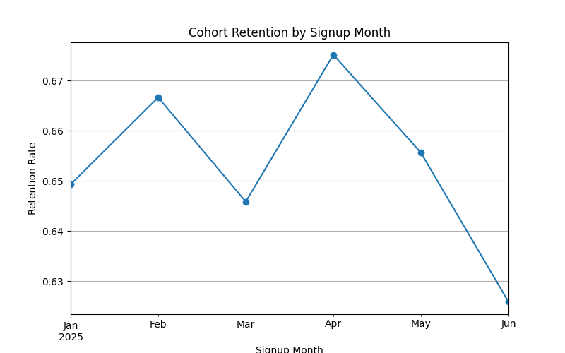
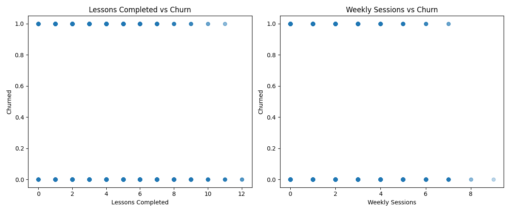

# User Retention Analytics Project

## Project Overview
This project analyzes user retention and churn behavior for a simulated online learning platform.  
Using Python and data analytics techniques, the project explores engagement patterns and builds a predictive churn model.

## Objectives
- Simulate user activity data
- Analyze cohort-based retention
- Explore engagement metrics
- Build a churn prediction model

## Dataset Features
- user_id
- signup_date
- lessons_completed
- weekly_sessions
- churn_probability
- churned

## Technologies Used
- Python
- Pandas
- NumPy
- Matplotlib
- Scikit-learn

## Analysis Performed

### Cohort Retention Analysis
Retention rates were calculated based on signup month cohorts.

### Engagement vs Churn
User engagement metrics were compared with churn outcomes.

## Churn Prediction Model
A logistic regression model was trained using:

- Lessons completed
- Weekly sessions

Model Accuracy: 0.71

Example prediction:

User behavior:
- Lessons completed: 3
- Weekly sessions: 1

Predicted churn probability:54.45%

## Project Structure
Retention_Analytics_Project
│
├── project2.py
├── user_dataset.csv
├── README.md
│
├── visuals
│ ├── cohort_retention.png
│ └── engagement_scatter.png
│
└── report

## Key Insights
- Higher weekly engagement reduces churn risk
- Cohort retention varies across signup periods
- Logistic regression provides a baseline churn prediction model
